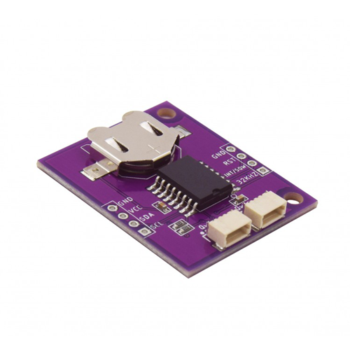

# Zio Qwiic RTC Module (DS3231SN)

> This product can be available for purchase [here](https://www.smart-prototyping.com/Zio-Qwiic-RTC-module-DS3231).

#### Description

This ZIO module features a low power real-time clock battery backed based on the DS3231SN IC. This board has a high precision and fast I2C (400kHZ) bus with an integrated temperature compensated 32KHz crystal oscillator (TCXO) and crystal. The TCXO provides a stable and accurate reference clock, and maintains the RTC to within ±2 minutes per year accuracy
from -40°C to +85°C.

The real-time clock counts seconds, minutes, hours a day, date, month and year with leap year compensation. The clock operates either the 4-hour to 12-hour format (which includes AM/PM indicator). It also compensate the month days, and the date is automatically adjusted at the end of the month. Some other cool features in this little board, it provides two programmable time-of-day alarms and a programmable square-wave output (check the [datasheet](https://datasheets.maximintegrated.com/en/ds/DS3231.pdf) to set the corresponding registers)

Make readings is pretty simple since all the communication is via I2C integrating the Qwiic connect system, but as most of our boards, we included the pinout in case you want to use a breadboard. The TCXO frequency output is available at the 32kHz pinout.

#### Specification

* Supply Voltage: 3.3V
* Current Consumption: 200μA
* Interface: I2C
* Battery Backup
* 32KHz crystal oscillator
* Operating Temperature Range -40°C to +85°C
* Low-Power Consumption
* Real-Time Clock Counts Seconds, Minutes, Hours, Day, Date, Month, and Year with Leap Year Compensation Valid Up to 2100
* Two Time-of-Day Alarms
* Programmable Square-Wave Output
* IC:DS3231SN
* I2C address: 0x68
* Dimensions: 30.1 x 36.4mm
* Weight:4.7g

#### Links

* [Eagle File and Schematic](https://github.com/ZIOCC/Zio-Qwiic-RTC-Module-DS3231SN)
* [Library Link](https://github.com/adafruit/RTClib)
* [DS3231 Datasheet](https://datasheets.maximintegrated.com/en/ds/DS3231.pdf)

> ###### About Zio
> Zio is a new line of open sourced, compact, and grid layout boards, fully integrated for Arduino and Qwiic ecosystem. Designed ideally for wearables, robotics, small-space limitations or other on the go projects. Check out other awesome Zio products [here](https://www.smart-prototyping.com/Zio).
